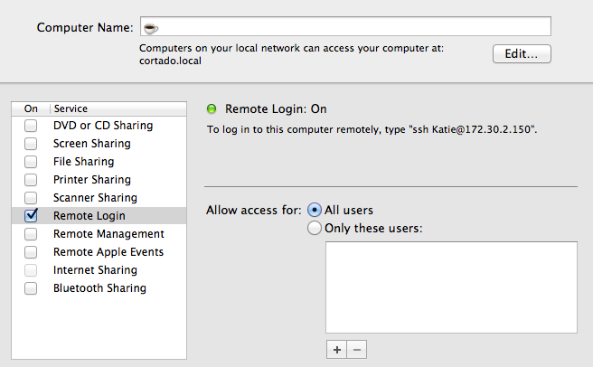

relay
========

Meta-magical SSH tunnels for remote developers behind firewalls.

Ever tried to pair-program with someone who works behind a firewall? You want to SSH into their machine, but you can't! Relay makes it possible to share your development environemnt with anyone by using another server in the middle to proxy the connection. And it doesn't just work with SSH--you can tunnel the webserver too!

Server setup
------------

Relay requires that you have a server running somewhere public which you can use to bounce connections from between your users. We use an EC2 micro in a public security group, but you can use anything you want. You'll need to make sure whatever ports you map in your ``ports.json`` are open to the world.

Install
--------

Relay can be installed in a virtualenv, but we recommend installing it with sudo so it is always available:

.. code:: bash

    $ sudo pip install relay

General setup
-------------

*(nprapps users see the next section)*

Relay uses a configuration file located at ``~/.relay.conf``. Create this file with contents such as:

.. code:: ini

    [relay]

    # User to connect to the relay server as
    user = ubuntu

    # Hostname or IP of the relay server
    server = relay_server.your_domain.com

    # Absolute path to the public and private SSH keys
    public_key = /path/to/your/public_key.pub
    private_key = /path/to/your/private_key

    # Username of the pair programmer account on each developer computer
    pair_user = relay

    # Absolute path to the port mapping file
    ports_json = /path/to/your/ports.json

    # Absolute path to a file containing bash aliases to be installed when creating the pair programmer user account
    bash_profile = /path/to/your/bash_profile

``ports.json`` is a mapping of user's local ports to remote ports on the server, so that users will never collide when creating SSH tunnels. Create this file with contents such as:

.. code:: javascript

    {
        "chris": {
            "22": "2222",
            "8000": "8000"
        },
        "katie": {
            "22": "2223",
            "8000": "8001"
        },
    }

``bash_profile`` is totally optional, but could contain aliases or environment variables you want every user to have automatically available.

You now need to create a ``relay`` user. This process is automated:

.. code:: bash

    $ relay setup

If you're running OS X, you need to enable remote login for the newly created ``relay`` user. Open System Preferences and navigate to the "Sharing" preference pane.

Check the box next to "Remote Login." You can either add the ``relay`` user to the allowed users, or just leave it open to "All users." 

NPRApps setup
-----------------

Pre-baked configuration files are in our Dropbox folder. You must have Dropbox installed, syncing to ``~/Dropbox`` and the ``nprapps`` shared folder synced to your local computer. Then run:

.. code:: bash

    $ ln -s ~/Dropbox/nprapps/relay/relay.conf ~/.relay.conf
    $ relay setup

Sharing SSH
------------------

To share your SSH connection (for tmux'ing), open a new terminal (or tab or tmux pane):

.. code:: bash

    $ relay user:$USER share:22

Where ``$USER`` is your username in ``ports.json``.

To connect to a shared SSH connection:

.. code:: bash

    $ relay user:$USER ssh

Where ``$USER`` is the username in ``ports.json`` of the user sharing the connection.

Sharing development webserver
-----------------------------

To share your local development webserver, open a new terminal (or tab or tmux pane):

..code:: bash

    $ relay user:$USER share:8000

Where ``$USER`` is your username in ``ports.json``.

To connect open a shared webserver in your browser:

.. code:: bash

    $ relay user:$USER web

Where ``$USER`` is the username in ``ports.json`` of the user sharing the webserver.
